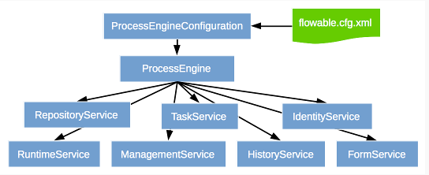

## Flowable基本概念

  ### 什么是Flowable？
Flowable是一个用Java编写的轻量级业务流程引擎。Flowable流程引擎允许您部署BPMN 2.0流程定义（用于定义流程的行业XML标准），创建流程定义的流程实例，运行查询，访问活动或历史流程实例和相关数据等等。
	Flowable是Activiti5.22的一个分支，Flowable6融合Activiti6的基本功能，并且修复了Activiti6的bug。
	
   [Java实例参考官网](https://www.flowable.org/docs/userguide/index.html#getting.started.command.line) 

### 数据库表名词解释
**Flowable**的数据库名称都以**ACT_开头**。第二部分是表的用例的双字符标识。此用例也将大致匹配服务API。

-   **ACT_RE_** *：_RE_代表`repository`。具有此前缀的表包含_静态_信息，例如流程定义和流程资源（图像，规则等）。  
-   **ACT_RU_** *：_RU_代表`runtime`。这些是包含流程实例，用户任务，变量，作业等的运行时数据的运行时表。Flowable仅在流程实例执行期间存储运行时数据，并在流程实例结束时删除记录。这使运行时表保持小而快。
-   **ACT_HI_** *：_HI_代表`history`。这些是包含历史数据的表，例如过去的流程实例，变量，任务等。
-   **ACT_GE_** *：`general`数据，用于各种用例。

### Flowable引擎开关配置项
  详见ProcessEngineConfiguration和ProcessEngineConfigurationImpl中的参数配置。
 - [ ] databaseSchemaUpdate: databaseSchemaUpdate`设置为"true"，引擎启动的时候，会自动检查Flowable库和类库中的不一致时候，就会自动升级数据库结构的到最新版本。
 - [ ] asyncExecutorActivate: 是一个管理线程池以触发计时器和其他异步任务的组件。默认情况下，`AsyncExecutor`未激活且未启动，如果asyncExecutorActivate配置为"true",可以与Flowable Engine一起启动异步执行程序。
 - [ ] history: 配置历史存储级别，可以配置下列历史级别：

    -   `none(无)`：跳过所有历史存档。对于运行时流程执行来说，是性能最高的配置，但是不会保存任何历史信息。    
    -   `activity(活动)`：存档所有流程实例与活动实例。在流程实例结束时，顶级流程实例变量的最新值，将被复制为历史流程实例。不会存档细节。   
   -   `audit(审计)`：默认级别。将存档所有流程实例，活动实例，并保持变量值以及所有提交的表单参数持续同步，以保证表单的所有用户操作都可追踪、可审计。
   -   `full(完全)`：历史存档的最高级别，因此也最慢。这个级别存储所有`audit`级别存储的信息，加上所有其他可用细节，主要是流程变量的更新。

 - [ ] asyncHistoryEnabled: 是否异步存储历史数据，默认为"false",启用异步历史记录时，历史数据将由历史作业执行程序保留，而不是作为运行时执行持久性的一部分的同步持久性。
 - [ ] processDefinitionCacheLimit: 所有流程定义都被缓存（在解析之后），以避免每次需要流程定义时都会访问数据库，并且流程定义数据不会更改。默认情况下，此缓存没有限制。此属性限制缓存大小的。

 - [ ] idBlockSize: 每一个流程引擎都有一个id生成器。默认的id生成器在数据库中保留一个块的id，这样其他引擎就不能使用同一个块中的id,此字段就是指定块的大小，就是id增长的步长。act_ge_property表中的next.dbid表示下一个id的大小。
 - [ ] activityFontName,labelFontName,annotationFontName: 这三个字段是设置字体的，一般都设置成一样的，比如"宋体"。
 - [ ] 其他待续


## Flowable API

### Process Engine API和服务
 - 基本结构图如下：
 
 
```
RuntimeService runtimeService = processEngine.getRuntimeService();

RepositoryService repositoryService = processEngine.getRepositoryService();
TaskService taskService = processEngine.getTaskService();
ManagementService managementService = processEngine.getManagementService();
IdentityService identityService = processEngine.getIdentityService();
HistoryService historyService = processEngine.getHistoryService();
FormService formService = processEngine.getFormService();
DynamicBpmnService dynamicBpmnService = processEngine.getDynamicBpmnService();
```
`ProcessEngines.getDefaultProcessEngine()`将在第一次调用时初始化并构建流程引擎，之后始终返回相同的流程引擎。可以使用`ProcessEngines.init()` 和完成所有流程引擎的正确创建和关闭`ProcessEngines.destroy()`。

- ProcessEngines类将扫描所有配置文件，配置方式有以下两种：

  - 标准的Flowable配置：配置文件为flowable.cfg.xml。其中流程引擎的创建方式有五种，可以参考ProcessEngineConfiguration类。其中经典构建方式为
 ```
ProcessEngineConfiguration.createProcessEngineConfigurationFromInputStream(inputStream).buildProcessEngine()。
 ```
  - Spring 风格配置：配置文件：flowable.cfg.xml。首先创建Spring应用程序上下文，然后从该应用程序上下文获取流程引擎。配置类为SpringProcessEngineConfiguration。
 
- services
    - **RepositoryService**： 用于流程部署是流程定义查询。 提供了五种部署方式：
         - [ ] classpath方式部署：
         ```
         DeploymentBuilder deploymentBuilder = repositoryService.createDeployment()
		         .category("classpath方式部署分类")
		         .name("classpath方式部署名称")
		         .addClasspathResource("classpath_deploy.bpmn");
         Deployment deploy = deploymentBuilder.deploy();
       ```
         - [ ] 文本方式部署:默认是UTF-8
         ```
         String text =  IoUtil.readFileAsString("classpath_deploy.bpmn");		     
         Deployment deploy = repositoryService
					         .createDeployment()
					         .addString("text_deploy.bpmn",text)
					         .deploy();         
         ```
         - [ ] 流的方式方式部署
        ```
        InputStream inputStream = MainClass.class.getClassLoader().getResourceAsStream("classpath_deploy.bpmn");

DeploymentBuilder deploymentBuilder = repositoryService.createDeployment()

.category("流的方式方式部署分类")

.name("流的方式方式部署名称")

.key("流的方式方式部署测试的key")

.addInputStream("inputstream_deploy.bpmn",inputStream);

Deployment deploy = deploymentBuilder.deploy();
        ```
         - [ ] 压缩包的方式方式部署
         ```
         InputStream inputStream = SpringTest.class.getClassLoader().getResourceAsStream("1.zip");
         ZipInputStream zipInputStream =  new  ZipInputStream(inputStream);
         Deployment deploy=repositoryService
                                            .createDeployment()
                                            .addZipInputStream(zipInputStream)
                                            .deploy();
         ```
         - [ ] 字节的方式方式部署
    - **RuntimeService**: 启动流程定义的新流程实例。也可以检索和存储服务流程变量，查询流程运行实例，出发流程实例继续执行。
    - **TaskService**：查询人工任务；创建新的_独立_任务。这些是与流程实例无关的任务，操作分配任务的用户或以某种方式参与任务的用户；认领任务，使得该用户可以执行此任务。
    - **IdentityService**: 组和用户的管理，也可以指定流程中的候选人。
    - **FormService**: 表单相关的服务，表单不需要嵌入到流程定义中。
    - **HistoryService**：和历史数据有关的服务。
    - **ManagementService**: 获取数据库和表单元数据信息，此外还可以对Job的查询和管理。
    - **DynamicBpmnService**： 改变流程定义的一部分，而无需重新部署，以更改流程定义中用户任务的受理人定义，或更改服务任务的类名称
 


 
 


<!--stackedit_data:
eyJoaXN0b3J5IjpbLTE0MjM4ODgwOTBdfQ==
-->