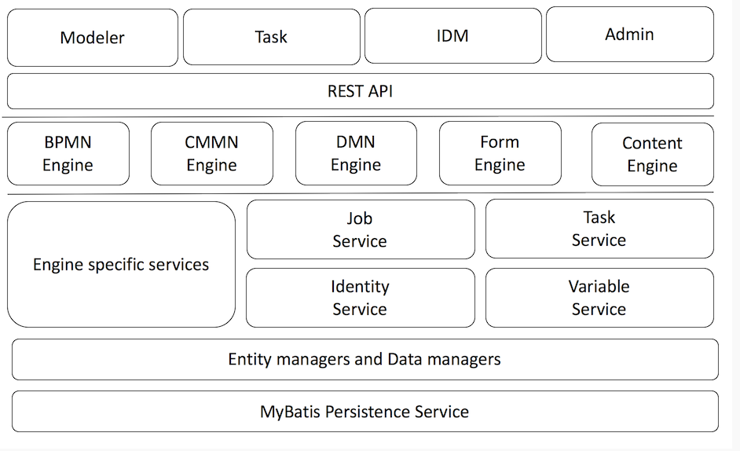

## 一、flowable6模块和架构


flowable由四个模块组成：BPMN用于流程管理，CMMN用于案例管理，DMN用于决策规则，FORM用于表单。

Flowable具有丰富的REST API，几乎可以完全覆盖Flowable Java API。这些是最简单，最灵活的API。 
此外，我们在Flowable v6中添加了Swagger。启动Flowable REST应用程序，通过访问http：// localhost：8080 / flowable-rest / docs来试用它。

架构：




## 二、BPMN2.0流程规范

BPMN是用于表示[OMG BPMN Standard](http://www.bpmn.org/)流程的广泛接受和支持的标准符号，flowablel6用的是BPMN2.0规范。

## 2.1 自定义扩展(Custom extensions)

 flowablel6提供了用户自定义扩展BPMN的功能，基于BPMN 2.0 XML协议规范。

### 2.2 事件

事件用于模拟在流程生命周期中发生的事情。事件主要有以下类型：


#### 2.2.1 开始事件：流程实例的启动位置


- 无开始事件(None Start Event)：

  ​	一个*没有*启动事件技术上意味着启动过程的实例的触发是不确定的。这意味着引擎无法预测何时必须启动流程实例

- 定时启动事件(Timer Start Event)：

  ​	计时器启动事件用于在给定时间创建流程实例。它既可以用于应该只启动一次的进程，也可以用于应该以特定时间间隔启动的进程

- 信号开始事件(Signal Start Event)：

  ​	信号启动事件可用于使用命名信号来启动一个过程实例。可以使用中间信号throw事件或通过API（*runtimeService.signalEventReceivedXXX*方法）从流程实例中*触发*信号。在这两种情况下，将启动具有相同名称的信号启动事件的所有流程定义。

- 消息开始事件(Message Start Event)：

  ​	用于使用已命名的信息来启动一个过程实例，消息启动事件的名称在所有已部署的流程定义中必须是唯一的。Flowable在部署包含一个或多个消息启动事件的流程定义时抛出异常，该消息启动事件引用与已由不同流程定义部署的消息启动事件同名的消息。

- 错误开始事件(Error Start Event)：

  ​	错误启动事件可用于触发事件的子过程。**错误启动事件不能用于启动流程实例**。错误启动事件总是在中断。


#### 2.2.2 活动任务

- 用户任务(User Task)

  ​	一个*用户任务*被用来模拟需要由人来完成的工作。当流程执行到达此类用户任务时，将在分配给该任务的任何用户或组的任务列表中创建新任务。

- 脚本任务(Script Task)

  脚本任务是一种自动活动。当进程执行到达脚本任务时，将执行相应的脚本。支持JavaScript、Groovy脚本。

  通过将流程变量名称指定为脚本任务定义的*“flowable：resultVariable”*属性的文字值，可以将脚本任务的返回值分配给已存在或新的流程变量。特定流程变量的任何现有值都将被脚本执行的结果值覆盖。如果未指定结果变量名，则会忽略脚本结果值。

- Java服务任务(Java Service Task)

  ​	Java服务任务用于调用外部Java类。要指定在流程执行期间调用的类，需要由**flowable：class**属性提供完全限定的类名。

  有四种方法可以声明如何调用Java逻辑：

  - 指定实现JavaDelegate或ActivityBehavior的类
  - 反射注入属性值
  - 调用方法表达式
  - 赋值表达式

- Web服务(Web Service Task)

  ​	Web Service任务用于同步调用外部Web服务。要使用Web服务，我们需要导入其操作和复杂类型。这可以通过使用指向Web服务的WSDL的import标记自动完成

- 业务规则任务(Business Rule Task)

  ​	业务规则任务用于同步执行一个或多个规则。Flowable使用Drools Expert，Drools规则引擎来执行业务规则。目前，包含业务规则的.drl文件必须与定义业务规则任务的流程定义一起部署，以执行这些规则。这意味着进程中使用的所有.drl文件都必须打包在进程BAR文件中，就像任务表单一样。

- 邮件任务(Email Task)

  ​	Flowable允许您使用向一个或多个收件人发送电子邮件的自动邮件服务任务来增强业务流程，包括支持cc，bcc，HTML内容等。请注意，邮件任务**不是** BPMN 2.0规范的*官方*任务（因此没有专用图标）。因此，在Flowable中，邮件任务被实现为专用服务任务。Flowable引擎通过具有SMTP功能的外部邮件服务器发送电子邮件

- http任务(Http Task)

  ​	Flowable引擎通过可配置的Http客户端发出Http请求。

- Camel Task任务(Camel  Task)

  ​	Camel任务允许您向Camel发送消息和从Camel接收消息，从而增强Flowable的集成功能。在Flowable中，Camel任务被实现为专用服务任务。必须在项目中包含Flowable Camel模块才能使用Camel任务功能。

  有关Camel路线的更多文档，您可以在[Camel网站](http://camel.apache.org/)上[查看](http://camel.apache.org/)。

- Mule Task任务(Mule Task)

  ​	mule任务允许您向Mule发送消息，增强Flowable的集成功能。请注意，Mule任务**不是** BPMN 2.0规范的*官方*任务（因此没有专用图标）。因此，在Flowable中，mule任务被实现为专用服务任务。

- 手动任务(Manual Task)

  ​	一个*手动任务*定义一个任务是外部的BPM引擎。它用于模拟由某人完成的工作，引擎不需要知道，也没有系统或用户界面。对于引擎，手动任务作为**传递活动**处理，从流程执行到达时自动继续流程。

- Java接受任务(Java ReceiveTask)

  ​	接收任务是一个等待某个消息到达的简单任务。目前，我们只为此任务实现了Java语义。当进程执行到达接收任务时，进程状态将提交给持久性存储。这意味着进程将保持此等待状态，直到引擎接收到特定消息，这将触发继续通过接收任务的进程。

- Shell Task

  ​	Shell任务允许您运行shell脚本和命令。请注意，Shell任务**不是** BPMN 2.0规范的*官方*任务。

- 执行监听器(Execution listener)

  ​	执行侦听器允许您在流程执行期间发生某些事件时执行外部Java代码或计算表达式。可以捕获的事件是：

  - 启动和结束流程实例。
  - 转型。
  - 开始和结束活动。
  - 启动和结束网关。
  - 开始和结束中间事件。
  - 结束开始事件并开始结束事件。

- 任务监听器(Task listener)

  ​	用于执行自定义的Java逻辑或某个任务相关的事件的发生的表达式。任务侦听器只能作为**用户任务**的子元素添加到流程定义中。

- 多实例任务(Multi-instance (for each))

  ​	用于业务流程的某些步骤的重复的方法。在编程概念中，多实例等同**于每个**构造：它允许您**按顺序或并行地**为给定集合中的每个项执行某个步骤，甚至是完整的子流程，运行时将要执行的活动多次。实际业务中在**会签、逐一审批、一票否决**等等场景下使用。一个*网关*或*事件***不能**成为多实例。

  根据BPMN 2.0规范的要求，每个实例的创建执行的每个父执行都将具有以下变量：

  - **nrOfInstances**：实例总数
  - **nrOfActiveInstances**：当前活动（尚未完成）实例的数量。对于顺序多实例，这将始终为1。
  - **nrOfCompletedInstances**：已完成实例的数量。

  可以通过调用`execution.getVariable(x)`方法来检索这些值。

  此外，每个创建的执行都将具有执行局部变量（对于其他执行不可见，并且不存储在流程实例级别）：

  - **loopCounter**：表示该特定实例*的for-each循环*中的*索引*。可以使用**Flowable elementIndexVariable**属性重命名loopCounter变量。

  例如：

  ```
  <multiInstanceLoopCharacteristics isSequential="false|true">
  <loopCardinality>5</loopCardinality>
   ...
  </multiInstanceLoopCharacteristics>
  ```

  **isSequential**属性表示该活动的实例被串行地或并行地执行。

  **loopCardinality** 活动时计算一次实例数。

- Compensation Handlers(补偿处理程序)

  ​	如果某个活动用于补偿另一个活动的影响，则可以将其声明为*补偿处理程序*。补偿处理程序在正常流程中不存在，仅在抛出补偿事件时执行。补偿处理程序不得有传入或传出的序列流。补偿处理程序必须使用定向关联与补偿边界事件相关联。


## 三、CMMN案例模型

### 3.1 基本概念和术语

案例管理模型和符号（CMMN）是[对象管理组](http://www.omg.org/spec/CMMN/)用于表示案例模型的标准符号和形式规范。

Flowable包含：

- CMMN 1.1建模器，用于创建CMMN 1.1案例模型
- 可以导入和执行CMMN 1.1案例模型的Java引擎
- 用于执行案例模型的演示UI，允许用户查看和完成人工任务（及其表单）。


一个**案例模型**总是可视化为某种*文件夹*包含所有情况下的元素。每例模型包含了**计划模型**到哪些项目将被*计划。*

计划模型的元素称为**计划项目**。每个*计划项*都有一个**计划项定义**，在运行时提供其类型和可能的配置选项。

在将案例模型部署到Flowable CMMN引擎之后，可以基于此案例模型启动**案例实例**。案例模型中定义的计划项类似地具有**计划项实例**运行时表示，这些表示由Flowable API公开，并且可以使用Flowable API查询。计划项实例具有在CMMN 1.1规范中定义的状态生命周期，并且是引擎工作方式的核心。

计划物品可以有*哨兵*：当哨兵“守卫”其激活时，据说计划物品具有*进入标准*。这些标准指定了*触发哨兵*必须满足的条件。

计划项目和计划模型也可以具有*退出条件的*哨兵，*退出条件*指定触发*退出*该特定计划项目的条件。

CMMN 1.1在XSD中定义了标准XML格式，它是规范的一部分。


### 3.2 结构

- 阶段(Stage)

  ​	阶段用于将计划项目组合在一起。它通常用于在案例实例中定义“阶段”。

  阶段是计划项目本身，因此可以具有进入和退出标准。只有当父级移动到*活动*状态时，才能使用计划条目中包含的计划项目。阶段可以嵌套在其他阶段。

- 任务(Task)

  ​	“手动”任务，意味着任务将在引擎外部发。

  属性：

  - **name**：将在运行时解析为手动任务名称的表达式
  - **blocking**：一个布尔值，用于确定任务是否阻塞
  - **blockingExpression**：一个表达式，其值为boolean，指示任务是否阻塞

  如果任务是非阻塞的，则引擎将在执行时自动完成。如果任务正在阻塞，*则*此任务的*PlanItemInstance*将保持*活动*状态，直到由*CmmnRuntimeService.triggerPlanItemInstance（String planItemInstanceId）*方法以编程方式触发

- 人类任务(Human task)

  ​	人工任务用于模拟人类需要完成的工作，通常是通过表格。当引擎到达人工任务时，将在分配给该任务的任何用户或组的任务列表中创建新条目。

  人工任务是计划项目，这意味着除了人工任务条目之外，还会创建*PlanItemInstance*，并且可以通过*PlanItemInstanceQuery*查询它。

  ​	可以通过*org.flowable.task.api.TaskQuery* API 查询*人工*任务。可以通过*org.flowable.task.api.history.HistoricTaskInstanceQuery*查询历史任务数据。

- Java服务任务(Java Service task)

  ​	服务任务用于执行自定义逻辑。

  ​	自定义逻辑放在实现*org.flowable.cmmn.api.delegate.PlanItemJavaDelegate*接口的类中。

- 决策任务(Decision task)

  ​	一个*决策任务*召唤出的DMN决策表和存储的情况下情况下所产生的变量。

  属性：

  - **决策表引用**：需要调用的引用的DMN决策表。

  *如果在没有规则被命中*属性的情况下设置*抛出错误，则*在评估DMN决策表期间没有命中规则时也可能抛出错误。

- Http任务(Http Task)

  ​	Http任务是*服务任务*的开箱即用实现。当需要通过HTTP调用REST服务时使用它。

- 脚本任务(Script Task)

  ​	类似于“脚本”的任务，类似于BPMN中的等效任务，脚本任务在计划项目实例变为活动时执行脚本。

- 里程碑(Milestone)

  ​	里程碑用于标记到达案例实例中的某个点。在运行时，它们表示为**MilestoneInstances**，可以通过*CmmnRuntimeService*通过**MilestoneInstanceQuery**查询它们。通过*CmmnHistoryService*还有一个历史对应物。

  里程碑是计划项目，这意味着除里程碑条目外，*还会*创建*PlanItemInstance*，可以通过*PlanItemInstanceQuery*查询。

- 案例任务(Case task)

  ​	案例任务用于在另一个案例的上下文中启动子案例，该*CaseInstanceQuery*有 *parent* options找到这些案例。当案例任务被阻止时(**blocking**配置为true)，*PlanItemInstance*将处于*活动状态，*直到子案例完全结束。如果案例任务是非阻塞的(**blocking**配置为false)，则启动子案例并自动完成计划项实例。子案例实例结束时，对父案例没有影响。

- 处理任务(Process task)

  ​	流程任务用于在案例的上下文中启动流程实例。当流程任务阻塞时，*PlanItemInstance*将处于*活动状态，*直到流程实例完全结束。如果流程任务是非阻塞的，则启动流程实例并自动完成计划项目实例。当流程实例结束时，对父案例没有影响。

- 标准(Criteria)

  入标准形成给定计划项目实例的哨兵。它们由两部分组成：

  - 依赖于其他计划项目的一个或多个部分：这些部分定义了对其他计划项目的状态转换的依赖性。例如，一个人工任务可以依赖于其他三个人工任务的状态转换*完成*本身变为活动状态
  - 一个可选的*if部分*或*条件*：这是一个允许定义复杂条件的表达式

  当所有标准都被解析为*真*时，哨兵就会满意。当标准评估为真时，将存储并记住该标准以供将来评估。请注意，只要案例实例发生更改，就会评估处于*可用*状态的所有计划项实例的条目标准。

- 事件监听(Event Listeners)

  ​	定时器事件监听器,当需要在案例模型中捕获时间传递时，使用计时器事件侦听器。

  计时器事件监听器不是任务，并且与*任务*相比具有更简单的计划项生命周期：当事件（在这种情况下，时间流逝）发生时，计时器将简单地从*可用*移动到*完成*。

- 项目控制：重复规则( Item control: Repetition Rule)

  ​	案例模型上的计划项目可以具有*重复规则*：可以用于指示某个计划项目需要*重复*的表达式。如果未设置表达式，但启用了重复（例如，在Flowable Modeler中选中了复选框）或表达式为空，则默认情况下将采用*true*值。

  可以设置可选的*重复计数器变量*，该*变量*保存实例的索引（从一开始）。如果未设置，则默认变量名称为*repeitionCounter*。

  如果计划项目没有任何条目标准，则在计划项目完成或终止时评估重复规则表达式。如果表达式解析为*true*，则会创建一个新实例。例如，具有重复规则表达式*$ {repetitionCounter <3}的*人工任务将创建三个连续的人工任务。

  如果计划项目具有条目标准，则行为不同。重复规则不会在完成或终止时评估，而是在满足计划项目的哨兵时评估。如果两个哨兵都满足并且重复规则评估为真，则创建新实例。

- 项目控制：手动激活规则(Item control: Manual Activation Rule)

  ​	案例模型上的计划项目可以具有*手动激活规则*：可以用于指示某个计划项目需要*由最终用户手动激活*的表达式。如果未设置表达式，但启用了手动激活（例如，在Flowable Modeler中选中了复选框）或表达式为空，则默认情况下将采用*true*值。

- 项目控制:必须规则(Item control: Required Rule)

  ​	案例模型上的计划项目可以具有*必需的规则*：可以用于指示*封闭阶段（或计划模型）所需*的特定计划项目的表达式。这可用于指示需要执行案例模型的哪些计划项目以及哪些是可选的。

  如果未设置表达式，但启用了所需规则（例如，在Flowable Modeler中选中了复选框）或表达式为空，则默认情况下将采用*true*值。

- 项目控制：完成中性规则(Item control: Completion Neutral Rule)

  ​	案例模型上的计划项目可以具有*完全中性规则*：一个表达式，可用于指示某个计划项目*在其父阶段（或计划模型）完成时*是*中性的*。这可以用于指示需要执行案例模型的哪些计划项以及哪些是可选的，作为在某些使用情况下使用*所需规则*和*autoComplete*的更灵活的替代方案。

  请注意，*完成中性规则*不是CMMN 1.1标准，而是Flowable特定的添加。

## 四、DMN决策规则

### 4.1 基本概念和术语

​	决策模型和符号（DMN）是[对象管理组](http://www.omg.org/spec/DMN/1.1)发布的标准。它是一种标准方法，用于在组织内描述和建模可重复决策，以确保决策模型可跨组织互换。


#### 4.2 DMN定义

​	DMN定义除其他外包括决策。决定有一个表达方式。DMN规范描述了几种类型的表达式。目前在Flowable DMN中，我们支持决策表类型的表达式。部署DMN定义时，可以将包含一个**决策表的**每个决策分别插入ACT_DMN_DECISION表中。

#### 

#### 4.2 DMN Engine API和服务

- DMN核心是DmnEngine，通过配置服务来实例化此对象。DMN中相关服务：

```java
DmnEngine dmnEngine = DmnEngines.getDefaultDmnEngine();
DmnRuleService dmnRuleService = dmnEngine.getDmnRuleService();
DmnRepositoryService dmnRepositoryService = dmnEngine.getDmnRepositoryService();
DmnManagementService dmnManagementService = dmnEngine.getDmnManagementService();

```

- DMN 标准配置文件：flowable.dmn.cfg.xml

- DMN Spring方式配置：flowable-dmn-context.xml


## 五、FORM表单

### 5.1 什么是表单定义？

​	对于BPMN引擎，我们遵守BPMN规范，对于DMN引擎，我们使用DMN规范。对于开始和任务表单，没有可以使用的Oasis规范。因此，我们定义了一个基于JSON的表单定义结构，我们将其用作Flowable表单编辑器的输出格式，并用于在Flowable Task应用程序中呈现启动和任务表单。


### 5.2 定义表单

​	使用文本或JSON编辑器创建一个新的JSON文件，并为其命名。确保文件**以.form结尾**，否则Form引擎将不会获取文件以进行部署。

​	表单定义JSON以*键*，*名称*和*描述*开头。在*关键的*属性所使用的表格引擎在整个表格引擎识别表单定义。版本控制系统还基于具有相同来源的表单定义的*键*属性相同。第二部分是定义表单定义的表单字段的字段数组。可选地，还有第三部分定义了表单结果。

```json
{
    "key": "form1",
    "name": "My first form",
    "fields": [
        {
            "id": "input1",
            "name": "Input1",
            "type": "text",
            "required": false,
            "placeholder": "empty"
        }
    ],
    "outcomes": [
        {
            "id": "null",
            "name": "Accept"
        },
        {
            "id": "null",
            "name": "Reject"
        }
    ]
}
```
<!--stackedit_data:
eyJoaXN0b3J5IjpbMTA0MDIxOTkzNiwtODQyOTc1OTgxXX0=
-->